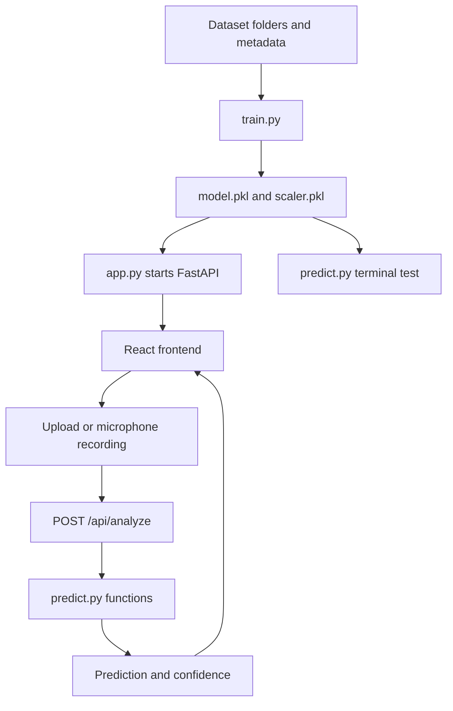

# AI Voice Detection: Code and Workflow Guide

## Short Answer

You do **not** need to run `train.py` and `predict.py` every time.

The normal workflow is:

1. Run `train.py` when you want to create or update the model.
2. Run `app.py` to start the FastAPI backend.
3. Use the React frontend or the API to analyze as many audio files as needed.

`app.py` loads the already-trained model files when it starts. It does not train
again for every request.

`predict.py` is useful for testing one file directly from the terminal. It is
not required when using the web frontend.

## Which File Should I Run?

| File         | Purpose                                          | Run when                                   |
| ------------ | ------------------------------------------------ | ------------------------------------------ |
| `train.py`   | Extracts training features and creates the model | Dataset or training settings change        |
| `predict.py` | Tests one audio file from the command line       | You want a quick terminal test             |
| `app.py`     | Starts FastAPI and serves web/API predictions    | Every time you want to use the application |

## Complete System Flow



## Step 1: `train.py`

### Main responsibility

`train.py` teaches an SVM classifier how to distinguish real and fake voices.
It reads audio files, converts them into numerical features, trains the SVM,
and saves the trained artifacts.

### Imports

```python
import os
import glob
import csv
import argparse
import json
```

These modules provide:

- `os`: safe file and directory paths
- `glob`: finding WAV files in folders
- `csv`: reading `release_in_the_wild/meta.csv`
- `argparse`: supporting command-line options
- `json`: saving validation metrics

```python
import librosa
import numpy as np
```

- `librosa` loads audio and extracts MFCC features.
- `numpy` stores and processes feature arrays and labels.

```python
from sklearn.model_selection import train_test_split
from sklearn.preprocessing import StandardScaler
from sklearn.svm import SVC
from sklearn.metrics import accuracy_score, confusion_matrix
import joblib
```

These are the machine-learning tools:

- `train_test_split`: creates training and validation data
- `StandardScaler`: puts features on a comparable scale
- `SVC`: Support Vector Machine classifier
- `accuracy_score`: measures correct predictions
- `confusion_matrix`: shows real/fake mistakes
- `joblib`: saves and loads the trained model files

### Project constants

```python
BASE_DIR = os.path.dirname(os.path.abspath(__file__))
```

This gets the directory containing `train.py`. It means the script can find the
dataset even if it is started from a different current directory.

```python
SUPPORTED_AUDIO_EXTENSIONS = {...}
```

This lists supported audio extensions. The training folders currently contain
WAV files, while the prediction/API path also supports formats such as MP3,
M4A, and WEBM when the required decoder is available.

### Feature extraction

```python
def extract_mfcc_features(audio_path, n_mfcc=13, n_fft=2048, hop_length=512):
```

This function converts one audio file into 13 numerical MFCC values.

```python
audio_data, sr = librosa.load(audio_path, sr=None)
```

It loads the waveform and keeps its original sample rate.

```python
mfccs = librosa.feature.mfcc(...)
```

It calculates Mel-Frequency Cepstral Coefficients. MFCCs describe acoustic
properties of speech that can help distinguish different voice signals.

```python
return np.mean(mfccs.T, axis=0)
```

The function averages each MFCC over time, producing one fixed-size feature
vector per audio file.

If loading fails, the function prints an error and returns `None`, allowing the
training loop to skip that file.

### Original dataset loading

```python
def create_dataset(directory, label):
```

This reads files from one labeled folder.

- `dataset/real` is assigned label `0`.
- `dataset/fake` is assigned label `1`.

The function extracts features for every WAV file and returns:

- `X`: feature vectors
- `y`: labels

### Release dataset loading

```python
def create_release_dataset(directory):
```

This reads the release dataset using its metadata rather than guessing from
filenames.

```python
label_map = {"bona-fide": 0, "spoof": 1}
```

This is the important label mapping:

- `bona-fide` means real human audio
- `spoof` means fake or synthetic audio

For every row in `meta.csv`, the function finds the matching WAV file, extracts
its MFCC features, and adds the correct label.

### Training and validation split

```python
train_model(X, y, sources, validation_size=0.5)
```

The current code uses a 50/50 split:

- 50% for training
- 50% for validation

The split is performed separately for each source. This ensures the original
samples and release samples are both represented in both sets.

```python
stratify=np.asarray(y)[source_indexes]
```

This keeps both classes represented in each source split.

### Source balancing

The release dataset is much larger than the original dataset. Without balancing,
the release files would dominate the classifier.

The code calculates a weight for each source and passes per-file weights into
the SVM:

```python
svm_classifier.fit(
    X_train_scaled,
    y_train,
    sample_weight=sample_weights
)
```

This gives the original source and release source approximately equal total
influence during training.

```python
SVC(
    kernel="linear",
    class_weight="balanced",
    probability=True,
    random_state=42
)
```

- `kernel="linear"`: uses a linear decision boundary
- `class_weight="balanced"`: compensates for real/fake class imbalance
- `probability=True`: enables probability estimates for confidence output
- `random_state=42`: makes the split and model repeatable

### Saved files

At the end of training, the script creates:

```text
model.pkl
scaler.pkl
training_metrics.json
```

These files are generated artifacts. They are used by the backend and should be
regenerated whenever the training data or training method changes.

## Step 2: `predict.py`

### Main responsibility

`predict.py` performs inference on one audio file. It does not train the model.

### Loading saved artifacts

```python
def load_model(base_dir=None):
```

This function locates and loads:

- `model.pkl`: trained SVM classifier
- `scaler.pkl`: feature scaler used during training

The same scaler must be used during prediction. Otherwise, the prediction
features would not have the same scale as the training features.

### Analyzing one file

```python
def analyze_audio(input_audio_path, model=None, scaler=None):
```

This function performs the inference pipeline:

1. Check that the file exists.
2. Check that its extension is supported.
3. Load the model and scaler if they were not supplied.
4. Extract MFCC features using the same function as training.
5. Scale the features.
6. Ask the SVM for a prediction.
7. Convert label `0` to `real` and label `1` to `fake`.
8. Calculate confidence.
9. Return the label and confidence.

```python
mfcc_features_scaled = scaler.transform(
    mfcc_features.reshape(1, -1)
)
```

The feature vector is reshaped into the two-dimensional format expected by
scikit-learn, then transformed using the saved scaler.

```python
prediction = model.predict(mfcc_features_scaled)[0]
```

The SVM predicts the class for the audio file.

```python
confidence = float(np.max(model.predict_proba(...)[0]))
```

For newly trained models with `probability=True`, this returns the larger of
the real and fake probability estimates.

Confidence is an estimate for one file. It is not the same thing as overall
validation accuracy.

### Running `predict.py` directly

```powershell
python predict.py
```

It asks for a path and prints a result. Use quotation marks for paths containing
spaces:

```text
"P:\AIVoice-Detection\samples\Para 5(English Real Audio).wav"
```

## Step 3: `app.py`

### Main responsibility

`app.py` is the FastAPI web server. It connects the React frontend to the model
logic in `predict.py`.

### Startup process

```python
@asynccontextmanager
async def lifespan(app: FastAPI):
```

This function runs during application startup.

```python
model_state['model'], model_state['scaler'] = load_model(BASE_DIR)
```

The backend loads the saved model and scaler once. This is why you do not need
to run training for every uploaded file.

If the files are missing, the backend starts in a degraded state and tells you
to run:

```powershell
python train.py
```

### FastAPI application

```python
app = FastAPI(...)
```

This creates the API application.

CORS middleware allows the Vite development server at port 5173 to communicate
with FastAPI at port 5000.

### Health endpoint

```text
GET /api/health
```

This tells you whether the backend is running and whether the model loaded.

Expected response when ready:

```json
{
  "status": "ok",
  "model_loaded": true,
  "model_error": null
}
```

### Analyze endpoint

```text
POST /api/analyze
```

The frontend sends a multipart form containing a field named `file`.

The endpoint:

1. Checks the filename.
2. Checks the audio extension.
3. Confirms that the model is loaded.
4. Saves the upload temporarily with a random filename.
5. Calls `analyze_audio` from `predict.py`.
6. Returns JSON containing prediction and confidence.
7. Deletes the temporary file in the `finally` block.

Example response:

```json
{
  "prediction": "real",
  "confidence": 0.87
}
```

### Starting the backend

```powershell
uvicorn app:app --reload --port 5000
```

You can also run:

```powershell
python app.py
```

because the bottom of `app.py` starts Uvicorn directly.

## React Frontend Integration

The React frontend supports two input methods:

1. Select or drag an audio file.
2. Record from the browser microphone.

For microphone recording, the browser creates a WebM or OGG file. React sends
that file to the same endpoint:

```text
POST /api/analyze
```

The Vite proxy maps the request like this:

```text
http://localhost:5173/api/analyze
                  |
                  v
http://localhost:5000/api/analyze
```

The frontend displays presentation stages while the single backend request is
running:

1. Input received
2. Pre-processing
3. Feature analysis
4. Voice classification
5. Analysis complete

These are visual progress stages. The backend returns one final response and
does not stream intermediate model stages.

## Mentor Demonstration Workflow

### First time or after retraining

```powershell
cd P:\AIVoice-Detection
.venv\Scripts\Activate.ps1
python train.py
```

Wait until `model.pkl` and `scaler.pkl` are created.

### Start the application

Terminal 1:

```powershell
uvicorn app:app --reload --port 5000
```

Terminal 2:

```powershell
cd frontend
npm run dev
```

Open:

```text
http://localhost:5173
```

### Later demonstrations

If the model files already exist and the dataset has not changed, skip training:

```powershell
uvicorn app:app --reload --port 5000
```

Then use the web interface directly.

## When Should I Retrain?

Run `python train.py` when:

- You add or remove training audio.
- You change the MFCC feature settings.
- You change the SVM settings.
- You change the train/validation split.
- You want to replace the model with a newer experiment.

Do not retrain just because you want to analyze another audio file.

## Important Interpretation

- Training accuracy or validation accuracy describes performance over a group
  of labeled files.
- Confidence describes the model's estimate for one input file.
- A high confidence result can still be wrong.
- A model can perform well on its validation source and poorly on recordings
  from a different microphone, language, speaker, or synthesis system.
